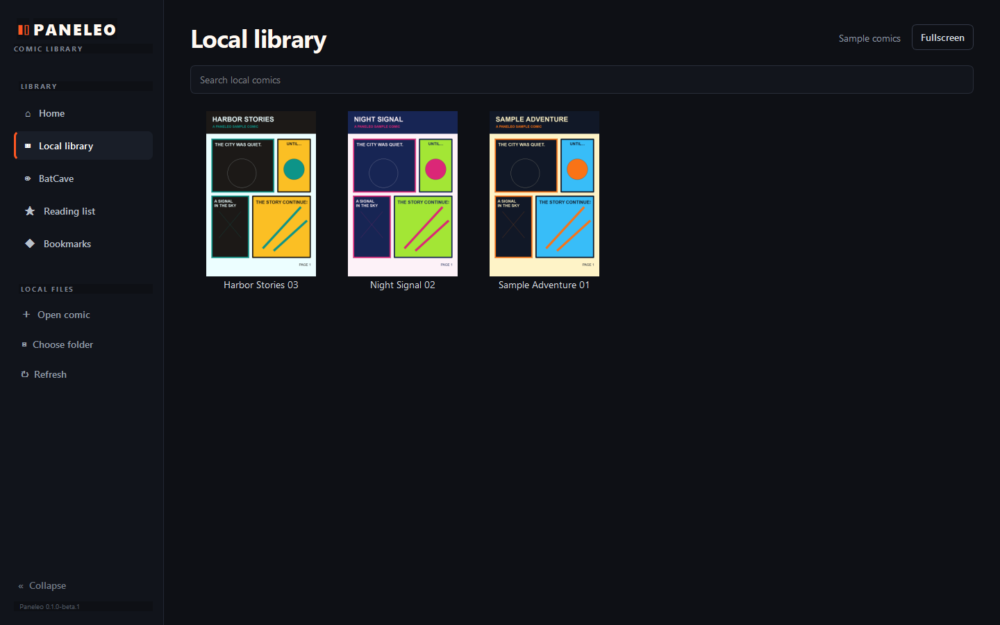

# Paneleo

Paneleo is an independent Windows desktop comic reader built with Python and PySide6. It brings local CBZ, CBR, and PDF comics together with an integrated browser for BatCave.biz.

I made Paneleo because I wanted one Windows application for both my local comic library and the comics I read through BatCave.

## Download

Download Paneleo from the [Releases page](https://github.com/dafka007/Paneleo/releases).

- **Installer:** download `Paneleo-Setup-0.1.0-beta.1.exe` for a normal Windows installation. It installs to Program Files and requires administrator permission.
- **Portable:** download `Paneleo-Portable-0.1.0-beta.1.zip`, extract it, open the `Paneleo` folder, and run `Paneleo.exe`. It does not require installation or administrator permission.

Python is not required for either build. The binaries are currently unsigned, so Windows SmartScreen may show an **Unknown Publisher** warning.

## What Paneleo does

Paneleo has two connected parts:

- A local comic library and reader for files stored on your computer.
- An integrated browser for browsing and reading comics on BatCave.biz.

Reading progress, local-library settings, BatCave bookmarks, and reading-list entries are kept in your Windows user data.

## BatCave reader

Paneleo includes an integrated browser for browsing and reading comics on BatCave.biz without switching between separate applications. Bookmarks, recent issues, and reading-list entries are kept in Paneleo's local data.

Because the integration depends on the BatCave.biz website, future website changes may temporarily affect parts of the reader until Paneleo is updated.

Paneleo is an independent third-party application and is not affiliated with or endorsed by BatCave.biz.

## Local comic reading

Open a comic directly or choose a folder to create a local library. Paneleo saves your current page, generates cover thumbnails, and lets you continue reading from the Home screen.

### Supported formats

| Format | Notes |
|---|---|
| CBZ | Supported directly |
| CBR/RAR | Requires [7-Zip](https://www.7-zip.org/) to be installed separately |
| PDF | Supported through PyMuPDF |

## Main features

- Local comic library with covers and saved progress
- Integrated BatCave.biz browsing and reading
- Click, keyboard, and on-screen page navigation
- Fullscreen reading
- Zoom, Fit Page, and Fit Width
- Manga reading direction
- BatCave bookmarks, recent issues, and reading list
- Installer and portable Windows builds

## Screenshots

### Local library

### Local comic reader

## Installation

Paneleo currently supports 64-bit Windows.

The installer places Paneleo in `C:\Program Files\Paneleo`, creates a Start Menu shortcut, and registers a normal Windows uninstall entry. Uninstalling Paneleo leaves your per-user reading data in place.

The portable build can be extracted anywhere you have permission to write files.

## How to run Paneleo

After using the installer, open **Paneleo** from the Windows Start Menu.

For the portable build:

1. Extract the ZIP.
2. Open the extracted `Paneleo` folder.
3. Run `Paneleo.exe`.

Do not move `Paneleo.exe` out of its folder; the bundled runtime files beside it are required.

## Current version

The current release is [Paneleo 0.1.0-beta.1](https://github.com/dafka007/Paneleo/releases/tag/v0.1.0-beta.1), the first public beta.

## Security and privacy notes

Paneleo stores its settings, progress, cache, and embedded-browser data under the current Windows user profile. Browser sessions may include locally stored website login data, so do not share your Paneleo AppData or browser-profile files.

Comic archives, PDFs, imported data, remote artwork, and web content should be treated as untrusted input. Paneleo is beta software and has not had a formal security audit. See [SECURITY.md](SECURITY.md) for vulnerability reporting.

## Known limitations

- Only 64-bit Windows is currently supported.
- CBR/RAR reading requires 7-Zip.
- BatCave integration can be affected by changes to BatCave.biz.
- The Windows binaries are unsigned.
- This is beta software and may still contain bugs.

## Troubleshooting

- **CBR files do not open:** install the current 64-bit version of [7-Zip](https://www.7-zip.org/), then reopen Paneleo.
- **Windows shows an Unknown Publisher warning:** the current builds are not code-signed.
- **Paneleo reports a missing Microsoft runtime:** install the current [Microsoft Visual C++ Redistributable for x64](https://learn.microsoft.com/cpp/windows/latest-supported-vc-redist).
- **BatCave pages no longer display correctly:** check for a newer Paneleo release and, if needed, [open an issue](https://github.com/dafka007/Paneleo/issues) with the steps that caused the problem.

## Development

Source setup, testing, and Windows build instructions are in [docs/BUILDING.md](docs/BUILDING.md).

Paneleo uses Python, PySide6/Qt WebEngine, and PyMuPDF.

## License and source

Paneleo-owned code is licensed under [AGPL-3.0-only](LICENSE). Third-party components retain their own licenses; see [THIRD_PARTY_NOTICES.md](THIRD_PARTY_NOTICES.md).

Each binary release includes a corresponding-source archive containing the matching Paneleo source and required upstream source archives. See [CORRESPONDING_SOURCE.md](CORRESPONDING_SOURCE.md).

Copyright (C) 2026 dafka007

## Disclaimer

Paneleo is an independent third-party application. It is not made by, affiliated with, or endorsed by BatCave.biz. BatCave.biz is accessed through Paneleo's integrated browser; Paneleo does not operate the website or host its catalog.
