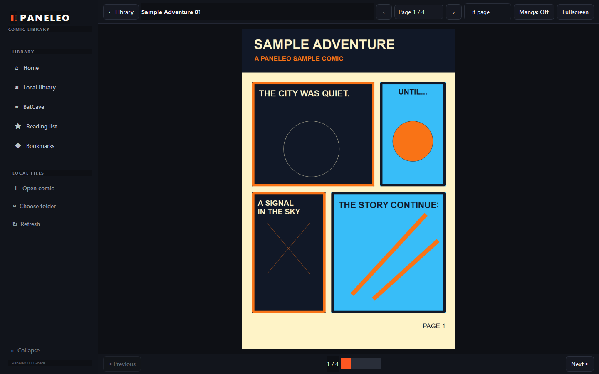

# Paneleo

Paneleo is a Windows comic reader I made because I wanted one place for my local comics and BatCave.

This is the first public beta. It reads CBZ, CBR, and PDF files, keeps track of where you stopped, and includes an embedded BatCave reader.

## Download

Go to the [Releases page](https://github.com/dafka007/Paneleo/releases) and choose one of these:

- **Installer:** download `Paneleo-Setup-0.1.0-beta.1.exe` for a normal Windows installation. It installs to Program Files and asks for administrator permission.
- **Portable:** download `Paneleo-Portable-0.1.0-beta.1.zip`, extract it, open the `Paneleo` folder, and run `Paneleo.exe`. It does not need installation or administrator permission.

Python is not required for either build. CBR/RAR files need [7-Zip](https://www.7-zip.org/) installed separately. The builds are currently unsigned, so Windows SmartScreen may show an **Unknown Publisher** warning.

## Screenshots

### Local library

### Local reader

## Features

- Open CBZ, CBR, and PDF comics or scan a folder into the local library.
- Resume local comics with saved page progress and cover art.
- Browse and read BatCave comics inside Paneleo.
- Keep BatCave reading progress, bookmarks, recent issues, and reading-list entries.
- Turn pages by clicking, using the keyboard, or using the on-screen controls.
- Zoom, Fit Page, Fit Width, use manga direction, and read fullscreen.

## A few notes

- Paneleo currently supports 64-bit Windows.
- BatCave support depends on the website and may need updates when the site changes.
- Paneleo data is stored per Windows user in `%APPDATA%\Paneleo`. Uninstalling the app leaves that data in place.
- If something breaks, open an issue with the steps that caused it.

## Development

Paneleo uses Python, PySide6/Qt WebEngine, and PyMuPDF. See [docs/BUILDING.md](docs/BUILDING.md) for source setup, testing, and Windows build instructions.

## License and source

Paneleo-owned code is licensed under [AGPL-3.0-only](LICENSE). Third-party components keep their own licenses; see [THIRD_PARTY_NOTICES.md](THIRD_PARTY_NOTICES.md).

Each binary release includes a corresponding-source archive with the exact Paneleo source and the source for bundled copyleft components. See [CORRESPONDING_SOURCE.md](CORRESPONDING_SOURCE.md).

Copyright (C) 2026 dafka007
